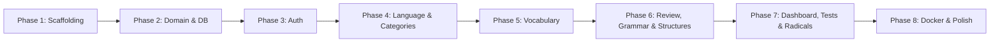

# YK Language Learning Website — Implementation Plan

> **Source:** [requirement.md](file:///d:/DotNet/LearnLanguageApp/requirement.md)
> **Created:** 2026-06-28

---

## Table of Contents

- [Phase 1 — Project Scaffolding & Infrastructure](#phase-1--project-scaffolding--infrastructure)
- [Phase 2 — Domain Layer & Database](#phase-2--domain-layer--database)
- [Phase 3 — Authentication & Authorization](#phase-3--authentication--authorization)
- [Phase 4 — Language & Category Management](#phase-4--language--category-management)
- [Phase 5 — Vocabulary (Words) Module](#phase-5--vocabulary-words-module)
- [Phase 6 — Word Review, Grammar & Sentence Structures](#phase-6--word-review-grammar--sentence-structures)
- [Phase 7 — Dashboard, Custom Test Builder & Radicals Module](#phase-7--dashboard-custom-test-builder--radicals-module)
- [Phase 8 — Docker, DevOps & Final Polish](#phase-8--docker-devops--final-polish)

---

## Phase 1 — Project Scaffolding & Infrastructure

**Goal:** Set up the solution structure, all projects, shared configuration, and verify that a bare-bones API + frontend run successfully.

### Task 1.1 — Create Solution & Backend Projects

| # | Task | Detail |
|---|------|--------|
| 1 | Create solution file | `dotnet new sln -n YK.LanguageLearn` |
| 2 | Create `YK.Domain` | Class library — entities, enums, domain interfaces |
| 3 | Create `YK.Application` | Class library — CQRS (MediatR), validators, application interfaces |
| 4 | Create `YK.Infrastructure` | Class library — EF Core DbContext, repos, UoW, external services |
| 5 | Create `YK.Presentation` | Class library — controllers, DTOs, mapping profiles, filters, middleware |
| 6 | Create `YK.API` | ASP.NET Core Web API — entry point only |
| 7 | Create `YK.Migration` | Console app — DbUp migration runner |
| 8 | Create `YK.Common` | Class library — shared utilities, constants, base classes |
| 9 | Add project references | Domain ← Application ← Infrastructure; Application ← Presentation; Presentation + Infrastructure ← API |

### Task 1.2 — Install NuGet Packages

| Project | Packages |
|---------|----------|
| `YK.Domain` | *(none — pure domain)* |
| `YK.Application` | `MediatR`, `FluentValidation`, `FluentValidation.DependencyInjectionExtensions` |
| `YK.Infrastructure` | `Microsoft.EntityFrameworkCore`, `Npgsql.EntityFrameworkCore.PostgreSQL`, `Microsoft.AspNetCore.Identity.EntityFrameworkCore` |
| `YK.Presentation` | `AutoMapper.Extensions.Microsoft.DependencyInjection`, `Microsoft.AspNetCore.Mvc.Core` |
| `YK.API` | `Swashbuckle.AspNetCore`, `Microsoft.AspNetCore.Authentication.JwtBearer` |
| `YK.Migration` | `dbup-core`, `dbup-postgresql` |
| `YK.Common` | `UUIDNext` (or equivalent UUIDv7 generator) |

### Task 1.3 — Shared Foundations in `YK.Common`

| # | Task | Detail |
|---|------|--------|
| 1 | `BaseEntity.cs` | Abstract class with `Id` (Guid/UUIDv7), `CreatedDate`, `CreatedBy`, `ModifiedDate`, `ModifiedBy`, `IsDeleted` |
| 2 | `UuidV7Generator.cs` | Static helper that generates UUIDv7 values |
| 3 | `ApiResponse<T>.cs` | Unified envelope: `{ Success, Data, Errors, Meta }` |
| 4 | `PaginationMeta.cs` | `{ Page, PageSize, TotalCount, TotalPages }` |
| 5 | `Constants.cs` | Shared constants (date format, default page size, etc.) |

### Task 1.4 — API Entry Point (`YK.API`)

| # | Task | Detail |
|---|------|--------|
| 1 | `Program.cs` | Configure host, register DI from all layers, add Swagger, CORS, JWT auth middleware |
| 2 | `appsettings.json` | Connection strings, JWT settings, S3 config placeholders |
| 3 | `appsettings.Development.json` | Development-specific overrides |
| 4 | Global exception middleware | Catch unhandled exceptions → return unified error envelope |

### Task 1.5 — Create Frontend Project (`YK.FrontEnd`)

| # | Task | Detail |
|---|------|--------|
| 1 | Initialize Next.js | `npx -y create-next-app@latest ./YK.FrontEnd` with App Router, TypeScript, ESLint |
| 2 | Install Tailwind CSS | Configure `tailwind.config.ts` and `globals.css` |
| 3 | Install Zustand | `npm install zustand` |
| 4 | Folder structure | `app/`, `components/`, `lib/`, `stores/`, `types/`, `services/` |
| 5 | API client setup | Create an Axios/fetch wrapper in `lib/api.ts` with base URL, JWT interceptor |
| 6 | Vietnamese locale | Set all UI labels/buttons/messages to Vietnamese |

### Task 1.6 — Verification

- [ ] `dotnet build` the entire solution — zero errors
- [ ] `dotnet run --project YK.API` — Swagger UI accessible at `https://localhost:<port>/swagger`
- [ ] `npm run dev` inside `YK.FrontEnd` — Next.js dev server loads
- [ ] Update `MEMORY.md` with Phase 1 results

---

## Phase 2 — Domain Layer & Database

**Goal:** Define all domain entities, configure EF Core, create seed data, and run the first migration.

### Task 2.1 — Domain Entities (`YK.Domain`)

| # | Entity | Key Fields |
|---|--------|------------|
| 1 | `User` (extends IdentityUser) | Custom fields: `DisplayName`, `AvatarUrl`, `ActiveLanguageId` + base entity fields |
| 2 | `Role` (extends IdentityRole) | Renamed from AspNetRoles |
| 3 | `Language` | `Name`, `LocaleCode`, `IsDefault`, `UserId` (null for default languages) |
| 4 | `UserLanguage` | `UserId`, `LanguageId` — join table |
| 5 | `Category` | `Name`, `Description`, `UserId`, `LanguageId` |
| 6 | `Word` | `Text`, `IPA`, `AudioUrl`, `ImageUrl`, `Note`, `Status` (enum: NotLearned/Learned/AlreadyKnown), `CategoryId`, `UserId`, `LanguageId` |
| 7 | `WordMeaning` | `WordId`, `TypeOfWord` (enum: Noun/Verb/Adj/…), `MeaningText` |
| 8 | `WordExample` | `WordId`, `Sentence` |
| 9 | `ReviewList` | `UserId`, `LanguageId` — the user's review list header |
| 10 | `ReviewListWord` | `ReviewListId`, `WordId` |
| 11 | `GrammarRule` | `Name`, `Description`, `UserId`, `LanguageId` |
| 12 | `GrammarExample` | `GrammarRuleId`, `Sentence` |
| 13 | `SentenceStructure` | `Pattern`, `VietnameseMeaning`, `UserId`, `LanguageId` |
| 14 | `SentenceStructureExample` | `SentenceStructureId`, `Sentence` |
| 15 | `StudySession` | `UserId`, `LanguageId`, `StartTime`, `EndTime`, `Mode` (enum) |
| 16 | `TestResult` | `UserId`, `LanguageId`, `TestType` (enum), `Score`, `TotalQuestions`, `Duration`, `ConfigSnapshot` (JSON), `TakenAt` |
| 17 | `Radical` | `Character`, `StrokeCount`, `VietnameseMeaning`, `Pinyin`, `Reading` |
| 18 | `RadicalExample` | `RadicalId`, `Word`, `VietnameseMeaning` |
| 19 | `RefreshToken` | `UserId`, `Token`, `ExpiresAt`, `IsRevoked` |

### Task 2.2 — Enums (`YK.Domain/Enums/`)

| # | Enum | Values |
|---|------|--------|
| 1 | `WordStatus` | `NotLearned`, `Learned`, `AlreadyKnown` |
| 2 | `TypeOfWord` | `Noun`, `Verb`, `Adjective`, `Adverb`, `Preposition`, `Conjunction`, `Other` |
| 3 | `StudyMode` | `FlashCards`, `Quiz`, `TypeAnswer` |
| 4 | `TestType` | `Vocabulary`, `Grammar`, `SentenceStructure`, `Custom` |
| 5 | `ReviewSubMode` | `WordToVietnamese`, `VietnameseToWord`, `SoundOrIPAToWord` |

### Task 2.3 — EF Core Configuration (`YK.Infrastructure`)

| # | Task | Detail |
|---|------|--------|
| 1 | `AppDbContext.cs` | Inherit from `IdentityDbContext<User, Role, Guid>`, register all DbSets |
| 2 | Entity configurations | One `IEntityTypeConfiguration<T>` per entity in `Configurations/` folder |
| 3 | Identity table renaming | Override `OnModelCreating` to rename `AspNetUsers` → `Users`, `AspNetRoles` → `Roles`, etc. |
| 4 | Global query filter | Apply `.HasQueryFilter(e => !e.IsDeleted)` on all entities inheriting `BaseEntity` |
| 5 | Audit interceptor | `SaveChangesInterceptor` to auto-set `CreatedDate`, `CreatedBy`, `ModifiedDate`, `ModifiedBy` |
| 6 | UUIDv7 value generator | Auto-generate UUIDv7 for `Id` on insert |

### Task 2.4 — Repository & Unit of Work (`YK.Infrastructure`)

| # | Task | Detail |
|---|------|--------|
| 1 | `IRepository<T>` | Generic interface in `YK.Application` — `GetByIdAsync`, `GetAllAsync`, `AddAsync`, `Update`, `Delete` (soft), `GetPagedAsync` |
| 2 | `Repository<T>` | Implementation in `YK.Infrastructure` |
| 3 | `IUnitOfWork` | Interface in `YK.Application` — `SaveChangesAsync`, `BeginTransactionAsync`, `CommitAsync`, `RollbackAsync` |
| 4 | `UnitOfWork` | Implementation in `YK.Infrastructure` |

### Task 2.5 — DbUp Migrations (`YK.Migration`)

| # | Task | Detail |
|---|------|--------|
| 1 | `Program.cs` | Configure DbUp to run scripts from `Scripts/`, `SeedData/`, and conditionally `SampleData/` |
| 2 | `Scripts/001_CreateTables.sql` | DDL for all tables defined above |
| 3 | `SeedData/001_SeedLanguages.sql` | Insert English, Chinese, Japanese as default languages |
| 4 | `SeedData/002_SeedRadicals.sql` | Insert 214 Chinese radicals with meanings, stroke counts, readings |
| 5 | `SampleData/001_SampleUsers.sql` | Test users (only runs in Development) |
| 6 | `SampleData/002_SampleWords.sql` | Sample vocabulary data (only runs in Development) |

### Task 2.6 — Verification

- [ ] Run `YK.Migration` → all scripts execute, `schemaversions` table populated
- [ ] Connect to PostgreSQL and verify tables exist with correct columns
- [ ] `dotnet build` — zero errors
- [ ] Update `MEMORY.md` with Phase 2 results

---

## Phase 3 — Authentication & Authorization

**Goal:** Implement sign-up, login, logout, forgot password, JWT + refresh token flow end to end (API + frontend).

### Task 3.1 — Backend: Application Layer

| # | Task | Detail |
|---|------|--------|
| 1 | `RegisterCommand` | Create user with email + password via Identity; return success |
| 2 | `RegisterCommandValidator` | FluentValidation: email format, password strength, required fields |
| 3 | `LoginCommand` | Verify credentials → generate JWT access token + refresh token → return both |
| 4 | `LoginCommandValidator` | Required email + password |
| 5 | `LogoutCommand` | Invalidate (revoke) the current refresh token |
| 6 | `RefreshTokenCommand` | Validate refresh token → rotate → issue new JWT + new refresh token |
| 7 | `ForgotPasswordCommand` | Generate password-reset token → send email with reset link |
| 8 | `ResetPasswordCommand` | Validate reset token → update password |
| 9 | `IJwtService` | Interface: `GenerateAccessToken(user)`, `GenerateRefreshToken()`, `GetPrincipalFromExpiredToken(token)` |
| 10 | `IEmailService` | Interface: `SendPasswordResetEmailAsync(email, resetLink)` |

### Task 3.2 — Backend: Infrastructure Layer

| # | Task | Detail |
|---|------|--------|
| 1 | `JwtService.cs` | Implement `IJwtService` — sign JWT with HMAC-SHA256, configurable expiry |
| 2 | `EmailService.cs` | Implement `IEmailService` — SMTP or SendGrid (configurable) |
| 3 | `RefreshToken` entity config | EF config with index on `Token` column |

### Task 3.3 — Backend: Presentation Layer

| # | Task | Detail |
|---|------|--------|
| 1 | `AuthController` | Endpoints: `POST /api/v1/auth/register`, `POST /api/v1/auth/login`, `POST /api/v1/auth/logout`, `POST /api/v1/auth/refresh`, `POST /api/v1/auth/forgot-password`, `POST /api/v1/auth/reset-password` |
| 2 | Request/Response DTOs | `RegisterRequest`, `LoginRequest`, `LoginResponse`, `RefreshRequest`, `ForgotPasswordRequest`, `ResetPasswordRequest` |
| 3 | Mapping profiles | AutoMapper profiles for auth DTOs ↔ commands |

### Task 3.4 — Frontend: Auth Pages

| # | Task | Detail |
|---|------|--------|
| 1 | `app/(auth)/login/page.tsx` | Login form: email + password fields, "Đăng nhập" button, link to register, link to forgot password |
| 2 | `app/(auth)/register/page.tsx` | Register form: email, password, confirm password, "Đăng ký" button |
| 3 | `app/(auth)/forgot-password/page.tsx` | Email input, "Gửi email đặt lại mật khẩu" button |
| 4 | `app/(auth)/reset-password/page.tsx` | New password + confirm, token from URL params |
| 5 | `stores/authStore.ts` | Zustand store: `user`, `accessToken`, `refreshToken`, `login()`, `logout()`, `register()`, `refreshSession()` |
| 6 | `lib/api.ts` update | Add JWT interceptor: attach `Authorization: Bearer <token>` header; auto-refresh on 401 |
| 7 | Auth layout | Centered card layout with background, logo, form area |
| 8 | Route protection middleware | `middleware.ts` — redirect unauthenticated users to `/login` |

### Task 3.5 — Verification

- [ ] Register a new user via Swagger → 201 Created
- [ ] Login → receive JWT + refresh token
- [ ] Access a protected endpoint with JWT → 200 OK
- [ ] Access without JWT → 401 Unauthorized
- [ ] Refresh token → new JWT + new refresh token, old refresh token invalidated
- [ ] Forgot password → email sent (or logged in console for dev)
- [ ] Frontend: complete login/register flow in the browser
- [ ] Update `MEMORY.md` with Phase 3 results

---

## Phase 4 — Language & Category Management

**Goal:** Implement language selection, custom language creation, and full CRUD for categories (API + frontend).

### Task 4.1 — Backend: Language Management

| # | Task | Detail |
|---|------|--------|
| 1 | `GetLanguagesQuery` | Return all default languages + user's custom languages |
| 2 | `CreateLanguageCommand` | Create a custom language (name + locale code) for the current user |
| 3 | `SetActiveLanguageCommand` | Set the user's `ActiveLanguageId` |
| 4 | `GetUserLanguagesQuery` | Return languages the user is learning |
| 5 | `AddUserLanguageCommand` | Add a language to the user's learning list |
| 6 | `LanguageController` | `GET /api/v1/languages`, `POST /api/v1/languages`, `PUT /api/v1/languages/active`, `GET /api/v1/languages/mine`, `POST /api/v1/languages/mine` |
| 7 | Request/Response DTOs | `LanguageDto`, `CreateLanguageRequest`, `SetActiveLanguageRequest` |
| 8 | Validators | Validate name required, locale code format |

### Task 4.2 — Backend: Category CRUD

| # | Task | Detail |
|---|------|--------|
| 1 | `GetCategoriesQuery` | Paginated list of categories for the active language |
| 2 | `GetCategoryByIdQuery` | Single category details |
| 3 | `CreateCategoryCommand` | Name + optional description; scoped to active language |
| 4 | `UpdateCategoryCommand` | Update name/description |
| 5 | `DeleteCategoryCommand` | Soft delete (set `IsDeleted = true`); words NOT affected |
| 6 | `CategoryController` | Standard REST: `GET`, `GET/:id`, `POST`, `PUT/:id`, `DELETE/:id` under `/api/v1/categories` |
| 7 | Validators | Name required, max length checks |
| 8 | DTOs & mapping | `CategoryDto`, `CreateCategoryRequest`, `UpdateCategoryRequest` |

### Task 4.3 — Frontend: Language Selector

| # | Task | Detail |
|---|------|--------|
| 1 | `stores/languageStore.ts` | Zustand store: `languages`, `activeLanguage`, `userLanguages`, `setActive()`, `fetchLanguages()` |
| 2 | Language selector component | Dropdown in the main navbar — shows active language with flag/icon, dropdown to switch |
| 3 | Add language modal | Form to create a custom language (name + locale code) |
| 4 | Language setup page | `app/(main)/languages/page.tsx` — manage languages the user is learning |

### Task 4.4 — Frontend: Categories

| # | Task | Detail |
|---|------|--------|
| 1 | `app/(main)/categories/page.tsx` | Grid/list of categories for active language, "Thêm danh mục" button |
| 2 | Category card component | Shows name, description, word count, edit/delete icons |
| 3 | Create/Edit category modal | Form: name (required), description (optional) |
| 4 | Delete confirmation modal | "Bạn có chắc muốn xóa danh mục này?" with confirm/cancel |
| 5 | `services/categoryService.ts` | API functions for CRUD |

### Task 4.5 — Frontend: Main Layout

| # | Task | Detail |
|---|------|--------|
| 1 | Sidebar navigation | Links: Tổng quan (Dashboard), Danh mục (Categories), Ôn tập (Review), Ngữ pháp (Grammar), Cấu trúc câu (Structures), Kiểm tra (Test), Bộ thủ (Radicals — conditional) |
| 2 | Top navbar | Logo, language selector dropdown, user avatar dropdown (profile, logout) |
| 3 | Responsive design | Collapsible sidebar on mobile, hamburger menu |
| 4 | Dark mode toggle | Light/dark theme switcher |

### Task 4.6 — Verification

- [ ] Create/read/update/delete categories via Swagger → correct responses
- [ ] Switch active language → categories are scoped accordingly
- [ ] Frontend: category CRUD flow works end to end
- [ ] Sidebar navigation renders correctly; radicals link shows only for Chinese/Japanese
- [ ] Update `MEMORY.md` with Phase 4 results

---

## Phase 5 — Vocabulary (Words) Module

**Goal:** Implement the full word management system including CRUD, auto-fetch IPA/sound, review list, and image upload.

### Task 5.1 — Backend: Word CRUD

| # | Task | Detail |
|---|------|--------|
| 1 | `GetWordsByCategoryQuery` | Paginated word list for a category; includes meanings, examples |
| 2 | `GetWordByIdQuery` | Single word with all related data |
| 3 | `CreateWordCommand` | Create word + meanings + examples + image; auto-set status to `NotLearned` |
| 4 | `UpdateWordCommand` | Update word text, IPA, audio, image, note, meanings, examples |
| 5 | `DeleteWordCommand` | Soft delete |
| 6 | `MarkWordAlreadyKnownCommand` | Set status to `AlreadyKnown` |
| 7 | `AddWordsToReviewListCommand` | Idempotent — add selected words to user's review list |
| 8 | `GetReviewListQuery` | Return all words in the user's review list for active language |
| 9 | `RemoveWordFromReviewListCommand` | Remove a word from review list |
| 10 | `WordController` | Endpoints under `/api/v1/categories/{categoryId}/words` and `/api/v1/review-list` |
| 11 | Validators | Word text required, at least one meaning required |
| 12 | DTOs & mapping | `WordDto`, `WordMeaningDto`, `WordExampleDto`, `CreateWordRequest`, `UpdateWordRequest` |

### Task 5.2 — Backend: Image Upload Service

| # | Task | Detail |
|---|------|--------|
| 1 | `IImageStorageService` | Interface: `UploadAsync(file) → url` |
| 2 | `LocalImageStorageService` | Save to `wwwroot/uploads/`, return relative path |
| 3 | `S3ImageStorageService` | Upload to AWS S3, return S3 URL |
| 4 | DI registration | Check `S3_PRE_URL` env var → register appropriate implementation |

### Task 5.3 — Backend: IPA/Pronunciation API (English)

| # | Task | Detail |
|---|------|--------|
| 1 | `IDictionaryService` | Interface: `LookupAsync(word, languageCode) → DictionaryResult` (IPA, audioUrl) |
| 2 | `DictionaryApiService` | Call `https://api.dictionaryapi.dev/api/v2/entries/en/{word}` → parse IPA + audio URL |
| 3 | `DictionaryController` | `GET /api/v1/dictionary/lookup?word=xxx&lang=en` — proxy endpoint for frontend |

### Task 5.4 — Frontend: Word List View

| # | Task | Detail |
|---|------|--------|
| 1 | `app/(main)/categories/[id]/page.tsx` | Word list page — displayed when user selects a category |
| 2 | Word table component | Columns: checkbox, word, IPA, Vietnamese meaning(s), action icons (edit, delete) |
| 3 | Checkbox behavior | Select words → "Thêm vào danh sách ôn" button appears → adds to review list (idempotent) |
| 4 | "Thêm từ" button | Opens create word modal |
| 5 | Pagination component | Page controls at the bottom |

### Task 5.5 — Frontend: Word Form Modal

| # | Task | Detail |
|---|------|--------|
| 1 | Word input | Text field (required); on blur → trigger IPA auto-fetch |
| 2 | IPA auto-fetch (English) | Call backend dictionary proxy → populate IPA field + store audio URL |
| 3 | IPA auto-fetch (Chinese) | Client-side: `pinyin-pro` → pinyin field; `pinyin2ipa` → IPA field |
| 4 | IPA auto-fetch (Japanese) | `kuroshiro` + `kuroshiro-analyzer-kuromoji` → romaji/furigana field |
| 5 | Speaker icon | Play audio: use stored audio URL for English; Web Speech API for Chinese (`zh-CN`) and Japanese (`ja-JP`) |
| 6 | Vietnamese meanings | Dynamic rows: each row = type-of-word combobox + meaning text; "Thêm nghĩa" button |
| 7 | Example sentences | Dynamic rows; "Thêm ví dụ" button |
| 8 | Image upload | File input or URL input; preview thumbnail |
| 9 | Note | Textarea |
| 10 | Already Known checkbox | Marks word status directly |
| 11 | Install npm packages | `pinyin-pro`, `pinyin2ipa`, `kuroshiro`, `kuroshiro-analyzer-kuromoji`, `wanakana` |

### Task 5.6 — Frontend: Review List Page

| # | Task | Detail |
|---|------|--------|
| 1 | `app/(main)/review/page.tsx` | List of words in the review list; remove button per word |
| 2 | "Bắt đầu ôn tập" button | Links to review session configuration (Phase 6) |

### Task 5.7 — Verification

- [ ] Create a word with multiple meanings and examples via Swagger → 201
- [ ] Upload an image (local storage) → file exists in `wwwroot/uploads/`
- [ ] Dictionary lookup returns IPA + audio for an English word
- [ ] Add words to review list (idempotent — no duplicates)
- [ ] Frontend: full word CRUD flow, IPA auto-fetch on blur, audio playback
- [ ] Frontend: select words via checkbox → add to review list
- [ ] Update `MEMORY.md` with Phase 5 results

---

## Phase 6 — Word Review, Grammar & Sentence Structures

**Goal:** Implement all three review modes (Flash Cards, Quiz, Type Answer), grammar CRUD + test, sentence structure CRUD + test.

### Task 6.1 — Backend: Word Review Session

| # | Task | Detail |
|---|------|--------|
| 1 | `StartReviewSessionCommand` | Create a `StudySession` record, select words from review list by priority (NotLearned → Learned → AlreadyKnown), respect word limit |
| 2 | `GetReviewSessionQuery` | Return session words with all details for the chosen mode |
| 3 | `SubmitReviewResultCommand` | Receive answers, calculate score, update word statuses, log session duration |
| 4 | `GenerateQuizOptionsQuery` | For quiz mode: generate 3 wrong options + 1 correct for each word |
| 5 | `ReviewController` | `POST /api/v1/review/start`, `GET /api/v1/review/session/{id}`, `POST /api/v1/review/session/{id}/submit` |
| 6 | DTOs | `ReviewConfigRequest` (wordLimit, mode, subMode), `ReviewSessionDto`, `ReviewResultRequest`, `ReviewSummaryDto` |

### Task 6.2 — Frontend: Review Session Configuration

| # | Task | Detail |
|---|------|--------|
| 1 | `app/(main)/review/start/page.tsx` | Config screen: word limit input (default 10), mode selection (Flash Cards / Quiz / Type Answer) |
| 2 | Sub-mode selector | For "Type Answer" mode: radio buttons for word→Vi / Vi→word / sound-or-IPA→word |
| 3 | "Bắt đầu" button | Calls `StartReviewSession` API → navigates to session page |

### Task 6.3 — Frontend: Flash Cards Mode

| # | Task | Detail |
|---|------|--------|
| 1 | Card component | Front: word + IPA + audio button; Back: Vietnamese meaning(s) + examples |
| 2 | Flip animation | CSS 3D flip on click/tap |
| 3 | Navigation | Previous / Next buttons; progress indicator (e.g., "3/10") |
| 4 | "Đã biết" button | Mark current word as Already Known |

### Task 6.4 — Frontend: Quiz Mode (4 Choices)

| # | Task | Detail |
|---|------|--------|
| 1 | Question display | Word + IPA + audio play button |
| 2 | 4 answer buttons | Vietnamese meaning options; highlight correct (green) / wrong (red) on click |
| 3 | Progress bar | Animated bar showing questions remaining |
| 4 | Auto-advance | After answer feedback (1.5s delay), move to next question |

### Task 6.5 — Frontend: Type Answer Mode

| # | Task | Detail |
|---|------|--------|
| 1 | Prompt display | Based on sub-mode: show word, or Vietnamese meaning, or play audio/show IPA |
| 2 | Text input | User types answer |
| 3 | Submit & feedback | Show correct/incorrect, reveal full word details |
| 4 | Next button | Advance to next question |

### Task 6.6 — Frontend: Session Summary

| # | Task | Detail |
|---|------|--------|
| 1 | Summary page | Total words, correct count, score %, time spent |
| 2 | Word status updates | Display which words changed status |
| 3 | "Quay lại" button | Return to review list |

### Task 6.7 — Backend: Grammar CRUD

| # | Task | Detail |
|---|------|--------|
| 1 | `GetGrammarRulesQuery` | Paginated list for active language |
| 2 | `GetGrammarRuleByIdQuery` | Single rule with examples |
| 3 | `CreateGrammarRuleCommand` | Name + description + examples |
| 4 | `UpdateGrammarRuleCommand` | Update name, description, examples |
| 5 | `DeleteGrammarRuleCommand` | Soft delete |
| 6 | `GenerateGrammarTestQuery` | Generate quiz from user's grammar rules (multiple choice) |
| 7 | `SubmitGrammarTestCommand` | Save results to `TestResult` |
| 8 | `GrammarController` | CRUD under `/api/v1/grammar`, test endpoints under `/api/v1/grammar/test` |
| 9 | DTOs & validators | `GrammarRuleDto`, `GrammarExampleDto`, `CreateGrammarRuleRequest`, etc. |

### Task 6.8 — Frontend: Grammar Pages

| # | Task | Detail |
|---|------|--------|
| 1 | `app/(main)/grammar/page.tsx` | Paginated list of grammar rules; "Thêm quy tắc" button |
| 2 | Grammar rule card | Name, description preview, example count, edit/delete icons |
| 3 | Create/Edit grammar modal | Name, description (rich text or textarea), dynamic example rows |
| 4 | `app/(main)/grammar/test/page.tsx` | Grammar test: multiple choice questions, timer optional, results summary |

### Task 6.9 — Backend: Sentence Structure CRUD

| # | Task | Detail |
|---|------|--------|
| 1 | `GetSentenceStructuresQuery` | Paginated list for active language |
| 2 | `CreateSentenceStructureCommand` | Pattern + Vietnamese meaning + examples |
| 3 | `UpdateSentenceStructureCommand` | Update pattern, meaning, examples |
| 4 | `DeleteSentenceStructureCommand` | Soft delete |
| 5 | `GenerateStructureTestQuery` | Generate multiple-choice test from saved structures |
| 6 | `SubmitStructureTestCommand` | Save results to `TestResult` |
| 7 | `SentenceStructureController` | CRUD under `/api/v1/sentence-structures`, test under `/api/v1/sentence-structures/test` |

### Task 6.10 — Frontend: Sentence Structure Pages

| # | Task | Detail |
|---|------|--------|
| 1 | `app/(main)/structures/page.tsx` | Paginated list; "Thêm cấu trúc" button |
| 2 | Structure card | Pattern text, Vietnamese meaning, example count |
| 3 | Create/Edit modal | Pattern, Vietnamese meaning, dynamic example rows |
| 4 | `app/(main)/structures/test/page.tsx` | Structure test page with multiple-choice + results |

### Task 6.11 — Verification

- [ ] Start a flash card review session → navigate cards → complete → summary shown
- [ ] Quiz mode: 4 choices render, feedback is immediate, score is correct
- [ ] Type answer mode: all 3 sub-modes work correctly
- [ ] Session duration is logged in `StudySession` table
- [ ] Grammar CRUD: create/edit/delete rules with examples
- [ ] Grammar test: generates questions, saves results
- [ ] Sentence structure CRUD + test: same as grammar
- [ ] Update `MEMORY.md` with Phase 6 results

---

## Phase 7 — Dashboard, Custom Test Builder & Radicals Module

**Goal:** Build the dashboard with charts, the custom mixed test builder, and the Chinese/Japanese radicals module.

### Task 7.1 — Backend: Dashboard Statistics

| # | Task | Detail |
|---|------|--------|
| 1 | `GetDailyStudyTimeQuery` | Aggregate `StudySession` data → minutes per day for last 30 days |
| 2 | `GetWordStatusDistributionQuery` | Count words by status (NotLearned / Learned / AlreadyKnown) for active language |
| 3 | `GetExamScoreHistoryQuery` | Return `TestResult` records for active language, ordered by date |
| 4 | `DashboardController` | `GET /api/v1/dashboard/study-time`, `GET /api/v1/dashboard/word-status`, `GET /api/v1/dashboard/exam-scores` |

### Task 7.2 — Frontend: Dashboard Page

| # | Task | Detail |
|---|------|--------|
| 1 | `app/(main)/dashboard/page.tsx` | Main dashboard layout with chart grid |
| 2 | Install chart library | `npm install recharts` (or `chart.js` + `react-chartjs-2`) |
| 3 | Daily study time chart | Line chart — X: dates (30 days), Y: minutes |
| 4 | Word status chart | Pie/donut chart — 3 segments with colors + labels |
| 5 | Exam scores chart | Histogram/bar chart — scores over time |
| 6 | Summary cards | Total words learned, study streak, total sessions, average score |
| 7 | Language scope | All charts update when active language changes |

### Task 7.3 — Backend: Custom Test Builder

| # | Task | Detail |
|---|------|--------|
| 1 | `GetTestSettingsQuery` | Return user's saved test settings (question count, timer) |
| 2 | `UpdateTestSettingsCommand` | Save/update test settings |
| 3 | `GenerateCustomTestQuery` | Draw N random questions from vocabulary + grammar + structures; return 4-choice questions |
| 4 | `SubmitCustomTestCommand` | Calculate score, save result + config snapshot |
| 5 | `GetTestHistoryQuery` | Paginated list of past test results |
| 6 | `CustomTestController` | `GET/PUT /api/v1/test/settings`, `POST /api/v1/test/generate`, `POST /api/v1/test/submit`, `GET /api/v1/test/history` |

### Task 7.4 — Frontend: Custom Test

| # | Task | Detail |
|---|------|--------|
| 1 | `app/(main)/test/page.tsx` | Test configuration: number of questions (default 15), timer (default 300s) |
| 2 | `app/(main)/test/session/page.tsx` | Test session: questions displayed one at a time, countdown timer, 4-choice buttons |
| 3 | Timer component | Countdown display; auto-submit when time expires |
| 4 | Results page | Score, breakdown by category (vocab/grammar/structure), time taken |
| 5 | `app/(main)/test/history/page.tsx` | Paginated list of past test results with scores and dates |

### Task 7.5 — Backend: Radicals Module

| # | Task | Detail |
|---|------|--------|
| 1 | `GetRadicalsQuery` | Return all 214 radicals, grouped by stroke count |
| 2 | `GetRadicalByIdQuery` | Single radical with examples |
| 3 | `GenerateRadicalQuizQuery` | Generate radical quiz (radical→meaning or meaning→radical), 4 choices |
| 4 | `SubmitRadicalQuizCommand` | Save quiz results |
| 5 | `RadicalController` | `GET /api/v1/radicals`, `GET /api/v1/radicals/{id}`, `POST /api/v1/radicals/quiz/generate`, `POST /api/v1/radicals/quiz/submit` |
| 6 | Access restriction | Middleware/filter: only accessible when user's active language is Chinese or Japanese |

### Task 7.6 — Frontend: Radicals Pages

| # | Task | Detail |
|---|------|--------|
| 1 | `app/(main)/radicals/page.tsx` | Radical list grouped by stroke count (1 stroke, 2 strokes, …); expand/collapse sections |
| 2 | Radical card | Character (large), stroke count, Vietnamese meaning, pinyin/reading |
| 3 | Radical detail modal | Full details + example words with Vietnamese meanings |
| 4 | Stroke drawing canvas | `<canvas>` element — show animated stroke order; user traces strokes with mouse/touch |
| 5 | Stroke validation | Compare user's drawn strokes against correct order; show feedback (correct ✓ / incorrect ✗) |
| 6 | `app/(main)/radicals/quiz/page.tsx` | Radical quiz: 4-choice (radical→meaning or meaning→radical); results summary |
| 7 | Conditional visibility | Only show "Bộ thủ" sidebar link when active language is Chinese or Japanese |

### Task 7.7 — Verification

- [ ] Dashboard charts render with real data; update when language changes
- [ ] Custom test: configure → take test → timer works → auto-submit on expire → results saved
- [ ] Test history page shows past results
- [ ] Radicals page shows 214 radicals grouped by stroke count
- [ ] Radical quiz works both directions (radical→meaning, meaning→radical)
- [ ] Stroke drawing canvas responds to mouse and touch input
- [ ] Radicals module hidden when active language is not Chinese/Japanese
- [ ] Update `MEMORY.md` with Phase 7 results

---

## Phase 8 — Docker, DevOps & Final Polish

**Goal:** Containerize all services, create Docker Compose setup, polish UI/UX, and perform final end-to-end testing.

### Task 8.1 — Dockerfiles

| # | Task | Detail |
|---|------|--------|
| 1 | `YK.API/Dockerfile` | Multi-stage build: restore → build → publish → runtime (aspnet:10.0) |
| 2 | `YK.Migration/Dockerfile` | Build migration runner; entrypoint runs DbUp then exits 0 |
| 3 | `YK.FrontEnd/Dockerfile` | Multi-stage: install deps → build → serve with Node.js (or standalone output) |
| 4 | `.dockerignore` per project | Exclude `bin/`, `obj/`, `node_modules/`, `.next/`, etc. |

### Task 8.2 — Docker Compose

| # | Task | Detail |
|---|------|--------|
| 1 | `docker-compose.yml` | Define services: `db`, `migrate`, `be`, `fe` |
| 2 | `db` service | PostgreSQL image; health check; volume for data persistence |
| 3 | `migrate` service | Depends on `db` health; runs DbUp scripts; exits 0 on success |
| 4 | `be` service | Depends on `migrate`; exposes API port; env vars from `.env` |
| 5 | `fe` service | Depends on `be`; exposes frontend port; env vars for API URL |
| 6 | `.env.example` | Document ALL environment variables: `DB_HOST`, `DB_PORT`, `DB_NAME`, `DB_USER`, `DB_PASSWORD`, `JWT_SECRET`, `JWT_EXPIRY`, `S3_PRE_URL`, `S3_BUCKET`, `S3_ACCESS_KEY`, `S3_SECRET_KEY`, `ASPNETCORE_ENVIRONMENT`, `SMTP_HOST`, `SMTP_PORT`, etc. |
| 7 | Network config | Internal Docker network for inter-service communication |

### Task 8.3 — UI/UX Polish

| # | Task | Detail |
|---|------|--------|
| 1 | Loading states | Add skeleton loaders / spinners for all async data fetches |
| 2 | Error handling | Toast notifications (e.g., `react-hot-toast`) for success/error messages |
| 3 | Empty states | Friendly empty state illustrations/messages for lists with no data |
| 4 | Animations | Page transitions, modal open/close animations, card hover effects |
| 5 | Accessibility | Keyboard navigation, ARIA labels, focus management in modals |
| 6 | Mobile responsiveness | Test and fix all pages on mobile/tablet breakpoints |
| 7 | Vietnamese text review | Ensure all labels, buttons, error messages, and placeholders are in Vietnamese |

### Task 8.4 — Final End-to-End Testing

| # | Task | Detail |
|---|------|--------|
| 1 | `docker-compose up --build` | All 4 services start successfully |
| 2 | Full user journey test | Register → Login → Add language → Create category → Add words → Review (all 3 modes) → Take grammar test → Take custom test → View dashboard |
| 3 | Chinese/Japanese flow | Switch to Chinese → radicals page visible → stroke drawing works → radical quiz works |
| 4 | Edge cases | Empty categories, no words in review list, expired JWT, concurrent requests |
| 5 | Performance check | Check API response times, frontend load times, chart rendering |
| 6 | Security review | JWT validation, authorization checks, SQL injection prevention (EF Core parameterized), XSS prevention |

### Task 8.5 — Documentation

| # | Task | Detail |
|---|------|--------|
| 1 | `README.md` | Project overview, tech stack, getting started (Docker + local dev), folder structure |
| 2 | API documentation | Swagger/OpenAPI spec is auto-generated; add XML comments to controllers |
| 3 | `MEMORY.md` final update | Complete log of all phases, issues found, and final status |

### Task 8.6 — Verification

- [ ] `docker-compose up --build` → all services healthy
- [ ] Complete user journey works end to end in Docker environment
- [ ] `.env.example` contains all required variables with descriptions
- [ ] `README.md` is complete and accurate
- [ ] All Vietnamese translations are correct and consistent
- [ ] Update `MEMORY.md` with Phase 8 results — **PROJECT COMPLETE**

---

## Summary: Phase Dependencies

> **Each phase must be verified and its results logged in `MEMORY.md` before moving to the next phase.**
